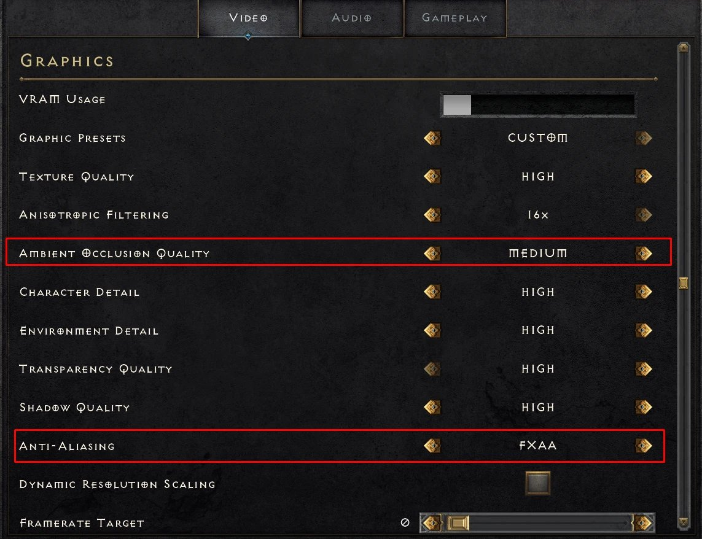
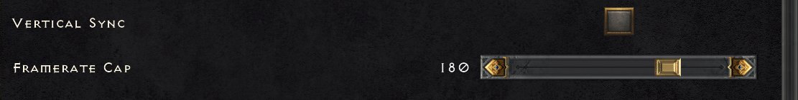
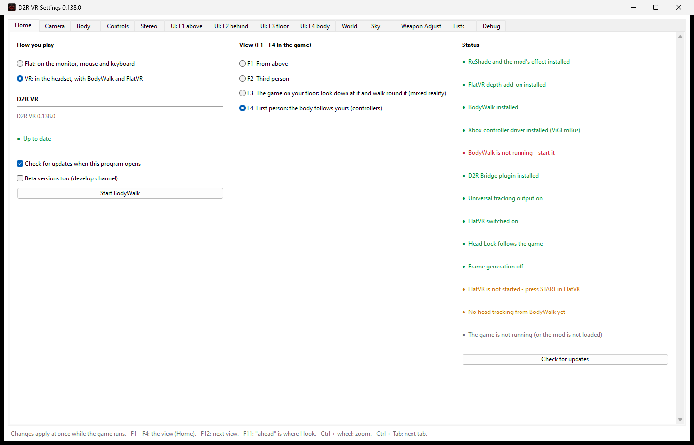

# D2R VR

Diablo II: Resurrected in a VR headset: the game's own view from above in true
3D, a free camera behind the hero, and the game laid on the floor of your room
(mixed reality), and first person with your body as the hero's: arms on the
controllers, the weapon in your hands - with a painted sky, depth fog and the
game's day and night.

**[Download D2R VR](https://bodywalkvr.com/api/download/latest?product=d2r_vr)** -
the ready installer, always the latest version. It sets up everything,
including a free BodyWalk Lite if you don't have BodyWalk.

**[Open the mod's page on BodyWalkVR](https://bodywalkvr.com/mods/d2r-vr)** - the
four views in video, the controls and the setup.

**What's new in 0.141:** the sky fixed in several areas (Tristram, Kurast,
Travincal, the River of Flame, the Chaos Sanctuary, Nihlathak's Temple); the
barbarian's left hand fixed - his second weapon sits properly and strikes;
daggers can be thrown. All versions: [CHANGELOG.md](CHANGELOG.md).

**Discussion, bugs and ideas:** our Discord, channel
[#diablo-2-vr](https://discord.com/channels/1481909961897279562/1556377249484251298)
under *Game Mods* - not on the server yet? [Join it here](https://discord.gg/kVYjEdJx3e).
Tell us what works, what doesn't and what you would like to see.

> Offline single-player only. Injecting code into the game online can get the
> account banned. This project is not made, endorsed or supported by Blizzard
> Entertainment.

It is a [D2RLoader](https://d2rloader.net) plugin (`d2rl-vrcam.dll`), a ReShade
effect (`D2R_DepthFog.fx`) and, for the headset, a BodyWalk plugin
(`d2r_bridge.dll`) that hands the head to the game; FlatVR (in BodyWalk) shows the
picture in the headset. Without a headset it plays flat on a monitor with mouse
and keyboard (F1 the game's camera, F2 third person, F3 first person).

## Views (F1 - F4 in the game, F12 goes round)

- **F1 From above** - the game's own camera; *Real geometry* draws it through our
  camera in true perspective and stereo.
- **F2 Third person** - a free camera behind the hero, turned with the head.
- **F3 The game on your floor** - look down at it and walk round it.
- **F4 First person** - the hero's arms follow the controllers and hold the
  weapon; the hero turns with you.

## The game's video settings

In Diablo II: Resurrected, Options > Video:

| Setting | Set to |
|---|---|
| **Vertical Sync** | **Off - important**: the mod draws the two eyes in turn, and VSync halves the frames each eye gets |
| **NVIDIA DLSS** | **Off - required**: DLSS builds each frame from the ones before it, and the mod's frames alternate between the eyes |
| Framerate Cap | 180 (90 for each eye) |
| **Anti-Aliasing** | FXAA or MSAA - **not TAA**: it builds each frame from the ones before it, like DLSS |
| Ambient Occlusion Quality | Medium |

### A square screen

For a square picture in the headset, either:

- **Windowed mode:** set the game to *Windowed* in Options > Video and drag
  the window's edges until it is square; or
- **FlatVR's virtual monitor:** in BodyWalk's FlatVR tab create a virtual
  monitor with a square resolution, move the game onto it, then switch the
  game to full screen there.

### The screen's size in the headset

How big the screen is, how far away and how curved: in BodyWalk, on the
**FlatVR** tab - or right in the headset, in FlatVR's overlay (**F10** by
default).

### The game in your room (F3, on the floor)

In D2R VR Settings > Camera > *F3 The game on your floor*, pick a **Background
round the game** colour (pure black or green). In Virtual Desktop turn on
passthrough with that colour as its colour key: the background is cut out and
the game stands in your real room.

## Controls in F1 - F3

From above, from behind and on the floor the game is played as with a gamepad:
BodyWalk turns the VR controllers into an Xbox pad.

| On the pad | On the VR controllers |
|---|---|
| Left stick (walk) | Left stick |
| D-pad up / down / left / right | Hold the left grip + left stick up / down / left / right |
| Map | Click the left stick |
| Menu | Hold the left stick down |
| Reset the centre ("ahead" is where I look) | Hold the right stick down |

Everything else is where the game's own gamepad layout puts it.

## Controls in F4 (first person)

> **Preview.** F4 is an early look, not a finished way to play the game: the
> weapons are not calibrated yet, so how a weapon sits in the hands and where
> it aims may be off for many of them. Weapon Adjust in D2R VR Settings lets you
> fix one by hand meanwhile.

| Action | How |
|---|---|
| Potions | On your belt: reach for them - set up in BodyWalk's Mapping as gestures |
| Bow, crossbow, fireballs and other spells | Right trigger - the shot goes where your hand points |
| Sword, axe and other melee | Swing it: a Strike Zone in BodyWalk's Mapping |
| Inventory | Hold the left stick down |
| Map | Click the left stick |
| Swap weapon sets | Click the right stick |
| Reset the centre | Hold the right stick down |

## Requirements

- Diablo II: Resurrected 3.3.93787 under D2RLoader 1.3.1 (other builds need
  their addresses checked; the plugin says so in its log)
- ReShade with add-on support, its Generic Depth add-on on
- For the headset: BodyWalk (Steam) with FlatVR and the D2R Bridge plugin

## Settings

`D2R_VR_Settings.exe`, next to `D2R.exe`. Changes apply at once while the game runs.
Every tab, with a picture and what it is for: [SETTINGS.md](SETTINGS.md).

## Building

Visual Studio 2022+ with CMake:

    cmake -S . -B build -A x64
    cmake --build build --config Release

D2RLoader's plugin SDK is fetched from GitHub. The headers of BodyWalk, FlatVR
and ReShade the build needs are in `external/`. `installer/` builds the setup
(Inno Setup 6).

## Thanks

The idea of a free 3D camera in D2R came from
[emmericp/D2R-3D](https://github.com/emmericp/D2R-3D). D2R VR has its own
camera and contains none of its code.

## Licences

D2R VR is MIT (`LICENSE`): use it, change it, build your own and share it -
keep the copyright notice. The licence does not cover the name "D2R VR" as a
mark, nor BodyWalk / FlatVR, which are separate products.

Third-party: MinHook (BSD 2-clause, `third_party/minhook`), the ReShade SDK
headers (BSD 3-clause, `external/reshade`), the D2RLoader plugin SDK (MIT).
Diablo II: Resurrected is Blizzard Entertainment's; this project is not affiliated
with or endorsed by Blizzard and ships none of the game's files.
