# D2R VR Settings - a tour of the tabs

`D2R_VR_Settings.exe` sits next to `D2R.exe` (Start menu: *D2R VR Settings*).
Every change applies at once while the game runs; nothing needs a restart unless
the label says so. The settings live in `d2rloader\plugins\d2r_vr.ini`.

Keys in the game: **F1 - F4** pick the view, **F12** goes to the next one,
**F11** makes "straight ahead" wherever you are looking. In this program
**Ctrl + wheel** zooms the window and **Ctrl + Tab** goes to the next tab.

The pictures show the VR set of tabs. With *Flat* chosen on Home the program
shows the flat set instead: views F1 - F3 and a *UI: F3 eyes* tab in place of
the headset-only ones.

---

## Home

- **How you play** - *Flat* (the monitor, mouse and keyboard, no headset) or
  *VR* (the headset, with BodyWalk and FlatVR).
- **View** - the view the game starts in; the same as pressing F1 - F4:
  - **F1 From above** - the classic camera, in real 3D.
  - **F2 Third person** - the camera behind your hero, you look around with your head.
  - **F3 On your floor** - the game as a living diorama on your floor or table.
  - **F4 First person** - your body is the hero's: arms on the controllers,
    the weapon in your hands.
- **D2R VR** - the version, the update check (*Up to date* or a download
  button), the beta channel.
- **Start BodyWalk / Start FlatVR / Stop FlatVR** - start BodyWalk, then FlatVR,
  right from here. Each button shows only when it can do something.
- **Status** - everything the VR chain needs, top to bottom: ReShade and the
  mod's effect, FlatVR's depth add-on, BodyWalk, the Xbox controller driver, the
  D2R Bridge plugin, BodyWalk's settings for the mod, FlatVR running, head
  tracking reaching the game, the game running with the mod. Green is fine;
  red or orange says what to do.

## Camera

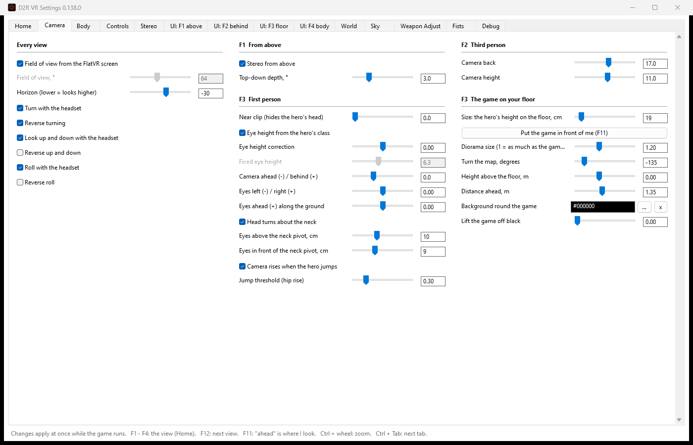

- **Every view** - the field of view (taken from the FlatVR screen by
  default), the horizon, and which head movements the camera follows: turn,
  look up and down, roll - each can be reversed.
- **F1 From above** - stereo from above and how deep the top-down 3D is.
- **F2 Third person** - how far behind and how high the camera is.
- **First person** - the near clip that hides your hero's own head, the eye
  height (from the hero's class, or fixed), where the eyes sit, turning the
  head about the neck, the camera rising when the hero jumps.
- **F3 The game on your floor** - the size of the diorama, *Put the game in
  front of me*, its turn, height and distance, the background round it.

## Body

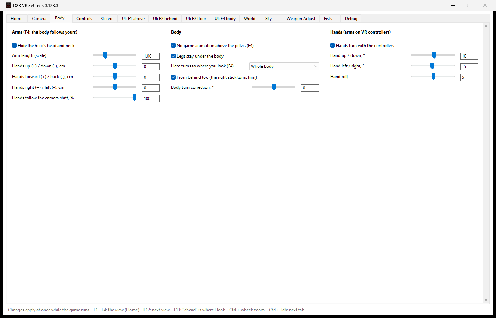

- **Arms** (F4) - hide the hero's head, arm length, shift the hands up, forward
  or sideways, how much the hands follow the camera.
- **Body** - no game animation above the pelvis in F4 (your body drives it),
  legs stay under the body, how the hero turns to where you look.
- **Hands** - the hands turn with the controllers; tilt, turn and roll offsets
  for your controllers' grip.

## Controls

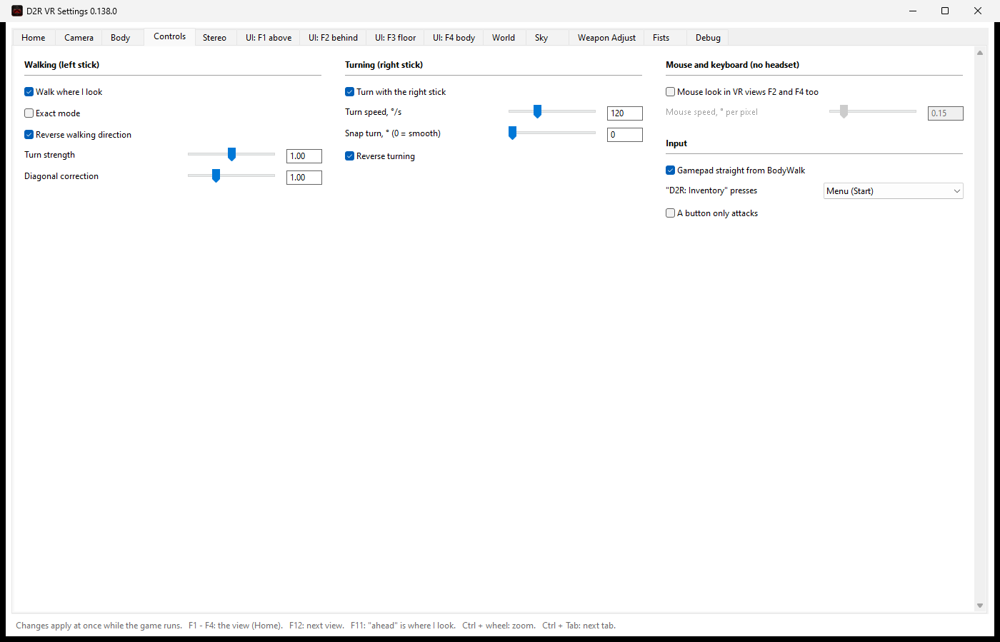

- **Walking (left stick)** - walk where you look, exact mode, reverse, turn
  strength, diagonal correction.
- **Turning (right stick)** - turning on the right stick, its speed, snap turn
  in degrees (0 = smooth), reverse.
- **Mouse and keyboard** - mouse look in the VR views F2 and F4 as well.
- **Input** - the gamepad straight from BodyWalk, which button *D2R: Inventory*
  presses, the A button only attacks.

## Stereo

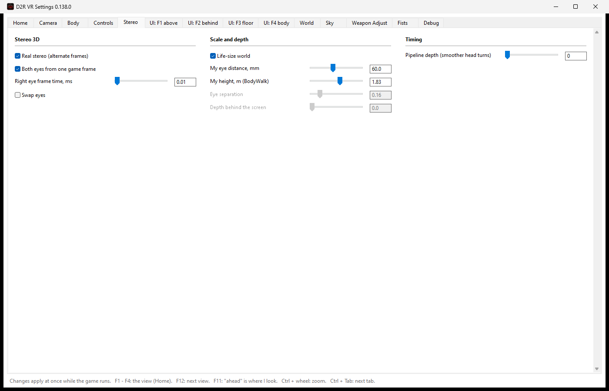

- **Stereo 3D** - real stereo: the game draws the left and the right eye in
  turn (or both from one game frame), the right eye's timing, swap eyes.
- **Scale and depth** - a life-size world from your eye distance and your
  height (both from BodyWalk), or eye separation and depth by hand.
- **Timing** - pipeline depth: a smoother head turn for a little more delay.

## UI: F1 above

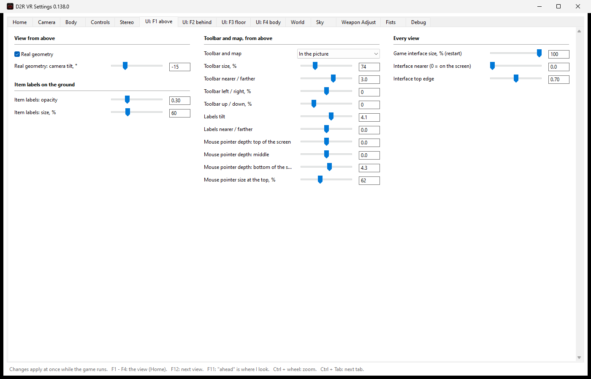

- **View from above** - *Real geometry*: the top view through our own camera in
  true perspective, and its tilt.
- **Toolbar and map, from above** - where they go (in the picture or the
  game's own way), size, distance, position; the tilt of the item labels; the
  depth of the mouse pointer at the top, middle and bottom of the screen, and
  how small it gets at the top.
- **Every view** - the game's interface size (restart), how near it floats,
  its top edge.
- **Item labels on the ground** - their opacity and size.

## UI: F2 behind

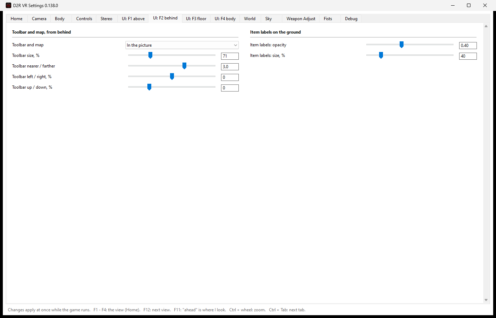

The toolbar and map in third person (where, size, distance, position) and the
item labels on the ground.

## UI: F3 floor

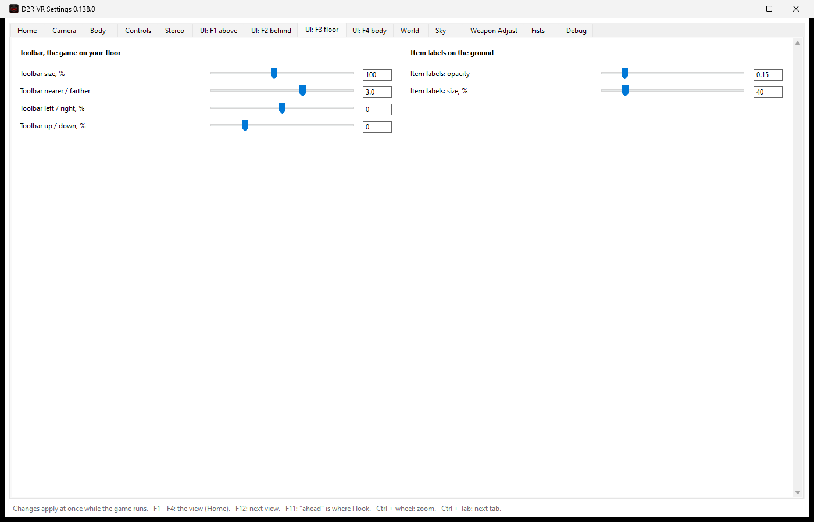

The toolbar while the game lies on your floor, and the item labels.

## UI: F4 body

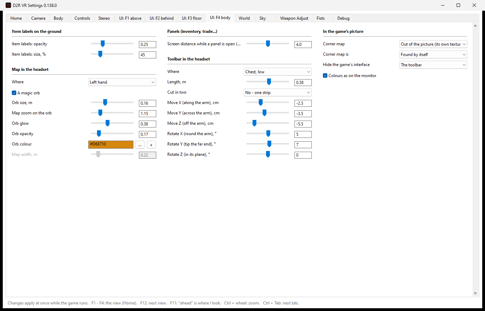

- **Map in the headset** - which hand holds it, as a glowing magic orb or a
  flat map: size, zoom, glow, opacity, colour.
- **Toolbar in the headset** - on your forearm or chest: length, one strip or
  cut in two, and its offset and turn.
- **Panels** - how far the screen moves back while the inventory or a trade
  window is open, so the whole panel is in view.
- **In the game's picture** - the corner map and which parts of the game's
  interface are hidden from the picture.
- **Item labels on the ground** - opacity and size.

## World

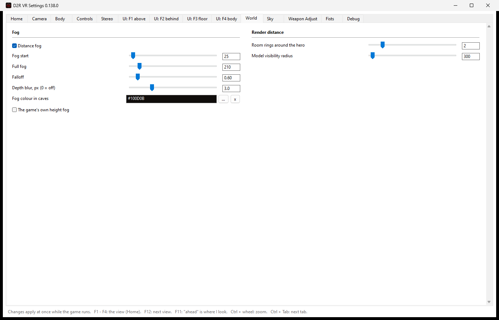

- **Fog** - distance fog, where it starts and where it is full, falloff, a depth
  blur, the fog colour in caves, the game's own height fog.
- **Render distance** - how many rings of rooms round the hero are drawn, and
  how far models stay visible.

## Sky

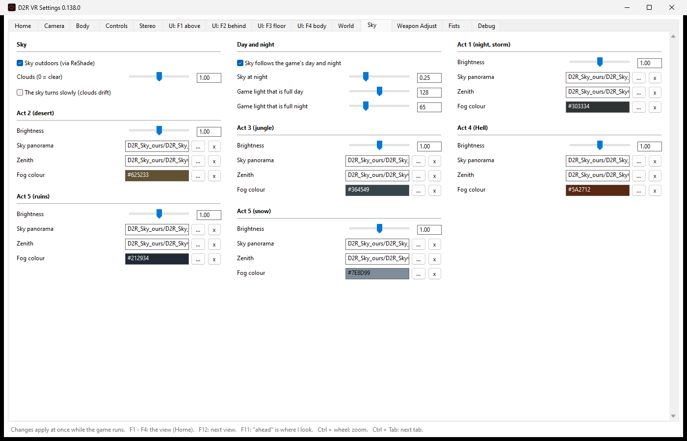

- **Sky** - a sky outdoors (drawn by our ReShade effect), clouds, slowly
  drifting clouds.
- **Day and night** - the sky follows the game's day and night, how dark the
  night sky gets, which game light counts as full day and full night.
- **Act 1 - Act 5** - per act (Act 5 twice: ruins and snow): brightness, the sky
  panorama and zenith pictures (your own work too: *...* picks one, *x* goes
  back to ours), the fog colour.

## Weapon Adjust

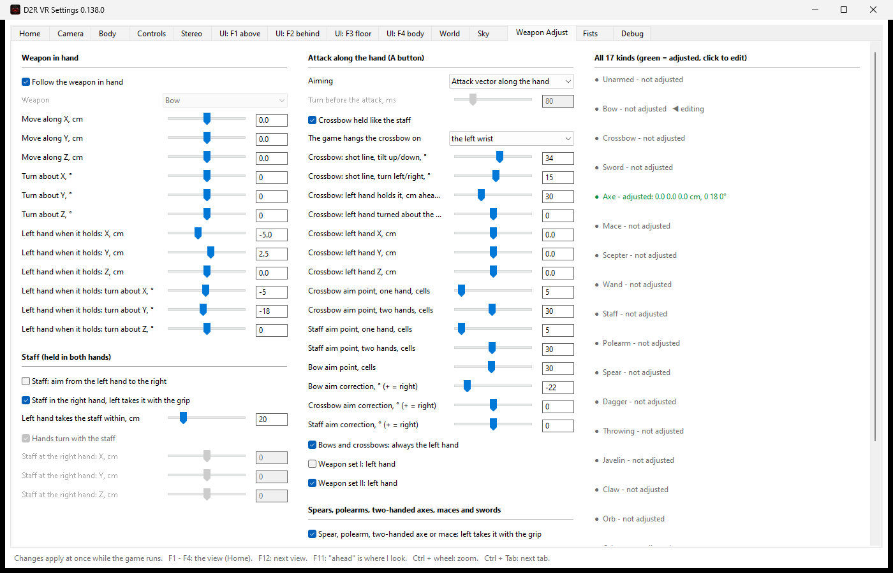

- **Weapon in hand** - follows the weapon your hero holds now; move and turn it
  in the hand, and where the left hand takes a two-handed weapon (one setting
  for all of them).
- **Staff** - right hand holds, left takes it with the grip and slides along
  the shaft.
- **Attack along the hand (A button)** - aiming along your hand; the crossbow's
  shot line and left hand; how far ahead bows, crossbows and staves aim; which
  hand holds bows and each weapon set.
- **Spears, polearms, two-handed axes, maces and swords** - the left hand takes
  them with the grip.
- **All 17 kinds** - green = adjusted; click one to edit it.

## Fists

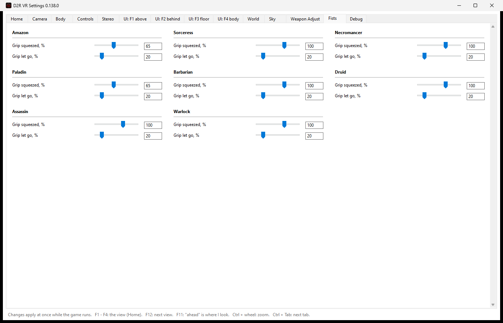

Per class: how far the hero's fingers close when you squeeze the controller's
grip, and when you let go.

## Debug

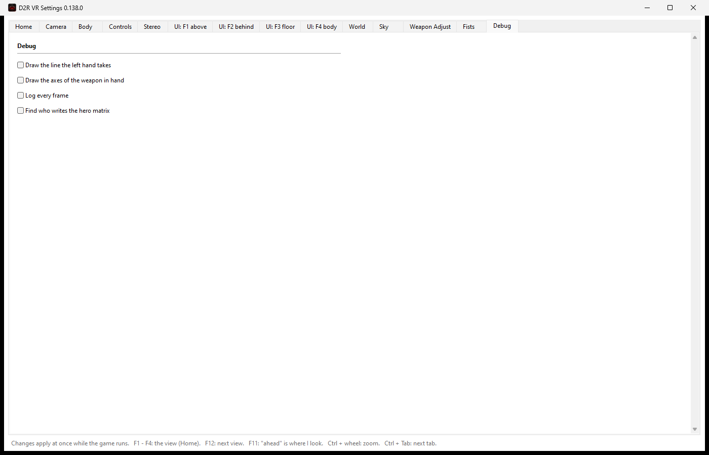

For finding problems: draw the line the left hand takes, draw the weapon's
axes, log every frame, find who writes the hero matrix. Leave these off to play.
